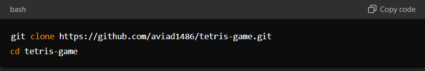
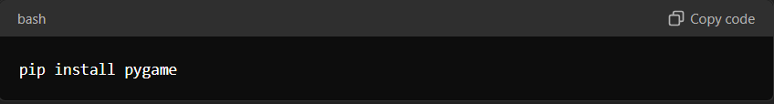
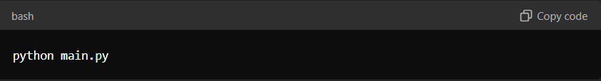
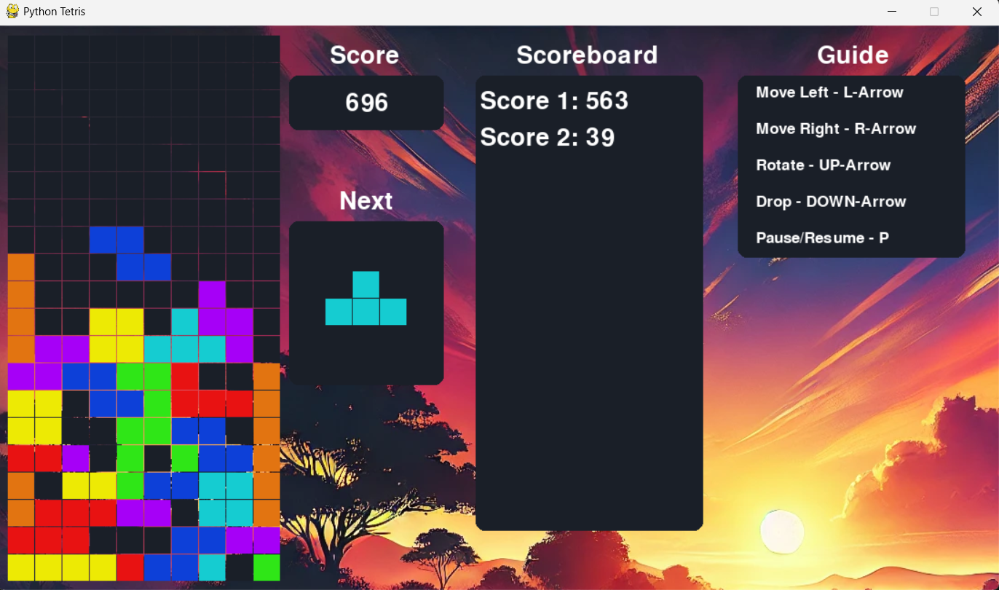

# Python Tetris Game

## Project Description
This project is a classic implementation of the Tetris game, developed using Python and the pygame library. It offers both a desktop version and a web version, allowing players to enjoy Tetris on their preferred platform. The game includes features such as score tracking, next block preview, and a pause/resume functionality.

## Game Overview
Tetris is a puzzle video game where players must arrange falling blocks, called Tetrominoes, into complete rows. Each Tetromino is made up of four squares, and the player can move them left, right, or down, as well as rotate them, to fit them into the grid. When a row is completely filled with blocks, it disappears, and the player earns points. the game ends when the stack of Tetrominoes reaches the top of the grid.

## Installation Instructions
To run the game locally, you'll need to have Python installed on your machine. Follow the steps below:
1) Open your terminal
2) Clone the Repository: Run the following command to clone the repository:

   git clone https://github.com/aviad1486/Tetris-Game.git
   
   cd Tetris-Game

   
   

4) Install Pygame library:
 
   pip install pygame

   

6) Run the game:

   python main.py

   

## How to Run the Game Locally
After following the installation instructions, you can run the game by executing the main.py file. The game window will open, and you can start playing by using the controls described below.

## Web Version
You can also play the Tetris game online via the web version. Simply follow the link below to start playing:
### https://aviad14200.itch.io/tetris
The web version offers the same gameplay experience as the desktop version.

## Game Controls
Move Left: Left Arrow

Move Right: Right Arrow

Rotate Block: Up Arrow

Drop Block Faster: Down Arrow

Pause/Resume Game: P

Reset Game After Game Over: Press any arrow key after the game over screen appears.

## Features
Score Tracking: The game tracks your score based on the number of lines cleared and blocks moved down.

Next Block Preview: See which block will appear next, allowing you to strategize your moves.

Pause/Resume: You can pause the game at any time by pressing P, and resume it by pressing P again.

Scoreboard: Keep track of your previous game scores and compare them to your current game.

## Credits
This project was developed using the pygame library. Special thanks to all the contributors who made pygame an excellent tool for game development.

## About
This Tetris game project was created by Aviad Zer in 2024 as a project for 'Advanced Programming' Course.
If you have any questions or suggestions, please contact me
### aviad1486@gmail.com

